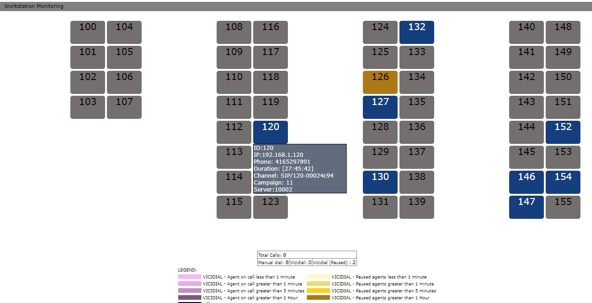

# floor-dashboard


```
PROJECT: Live Call Monitoring (Vicidial & Manual Dial)
AUTHOR: Aries Laluces
20100723 - initial CODE
         - javascript auto refresh
         - css tooltip 
         - can monitor manual dial for now
20100724 - monitor vicidial
         - color legend and total calls
20100725 - ping checker (crontab)
20100730 - toggle auto screen update
         - 5522
20100918 - v0.0.3
         - edit mode
         - multi layout
20110507 - 0.0.4
         - Code Rewrite
         - Apply MVC framework
         - jQuery
         - AJAX enabled
20110512 - done with:
         - color legend (manual + vicidial)
         - 5522
         - popup info
20110528 - multi layout (index.php?layout=10001)
20110619 - Port to agiweb
20111204 - OOP+MVC
         - IP based access
20121109 - click to spy
20130213 - jquery update - for new browsers
20130826 - Inbound/Tollfree (see agiweb_inbound.php)
```
